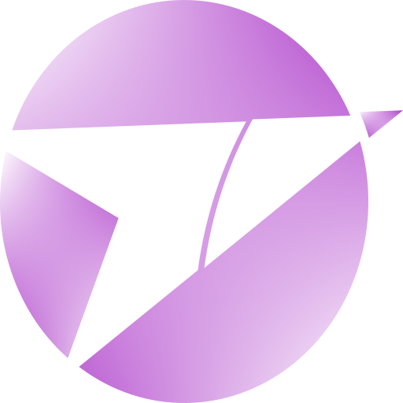
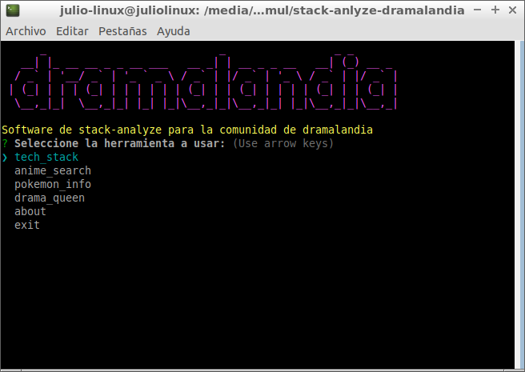

# stack-analyze dramalandia



sotware de consola enfocado para la comunidad dramalandia del dannyaegyo es una version simplificada de la primera generacion de stack-analyze (1.0.4 a 1.0.9) siendo el primer CLI enfocado a los fanaticos de anime.


## uso

el uso es tanto instalacion global como uso portable

``` sh
# npm 8.10 inferior
npm i -g stack-analyze@dramalandia

# npm 8.12 superior
npm i --location=global stack-analyze@dramalandia

# uso portable
npx stack-analyze@dramalandia
```

## ejemplo

